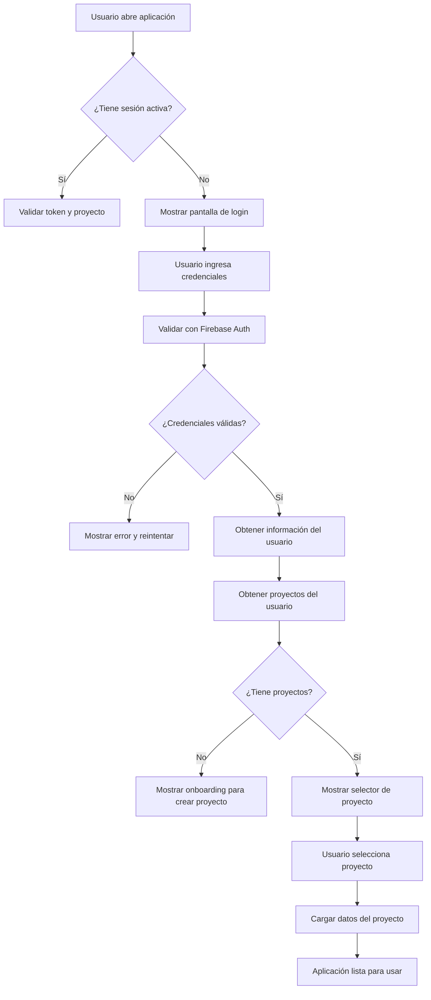
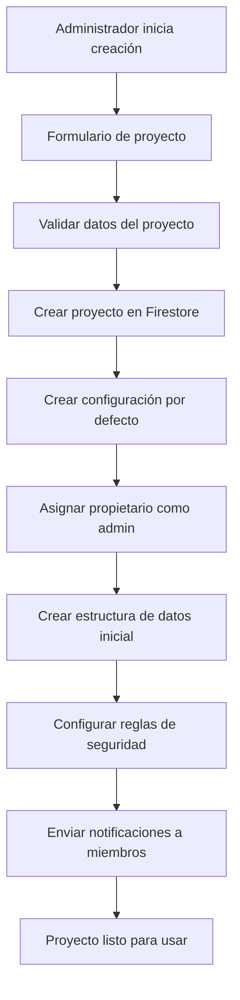
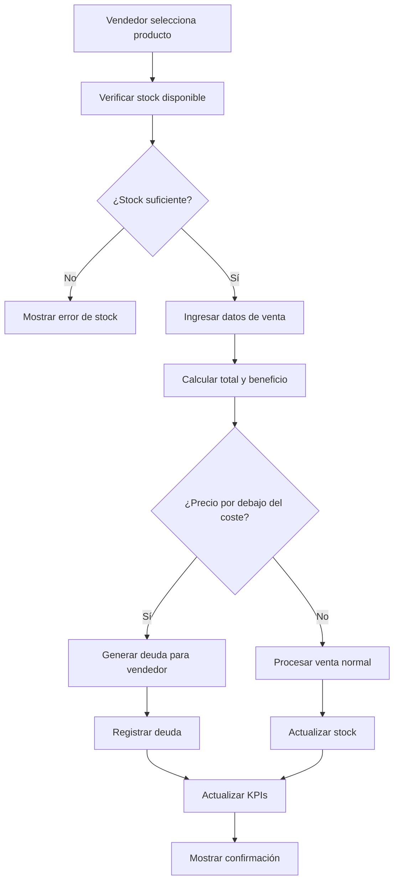
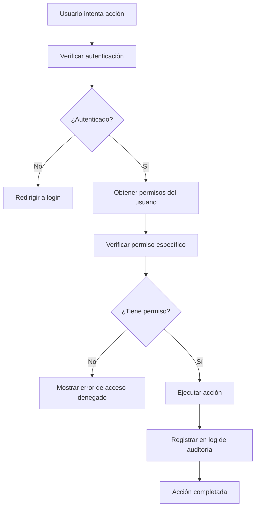
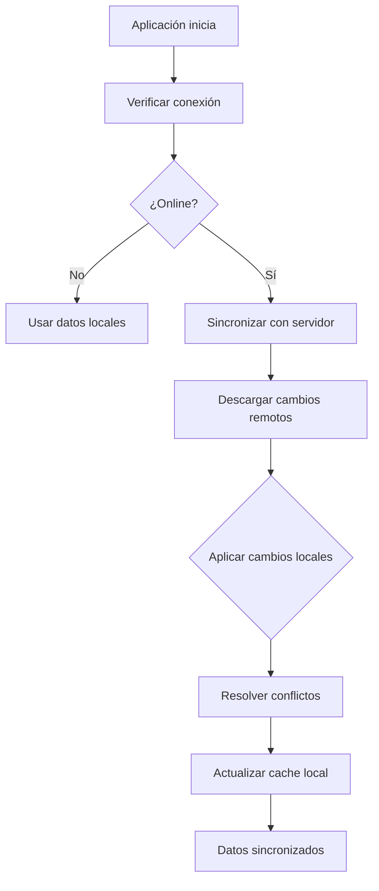
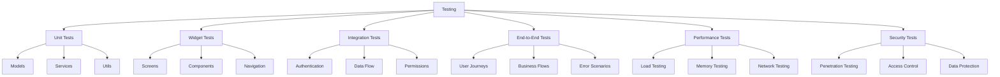
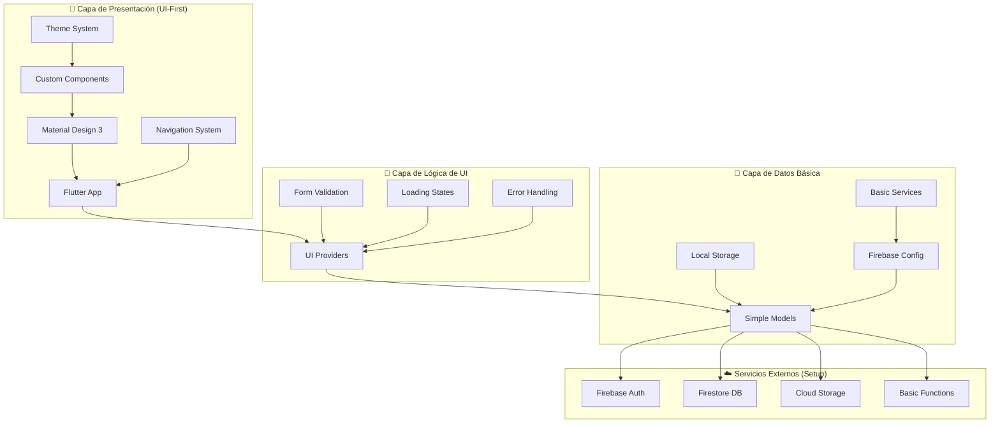
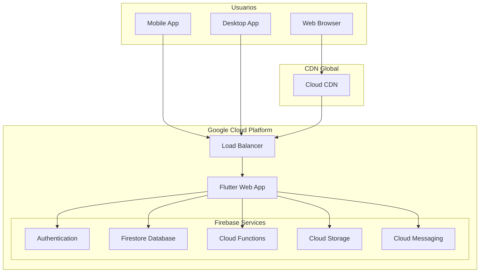

# Documentación Completa - App de Ventas 3M (Desarrollo desde Cero)

## 1. Introducción y Visión General

### Visión del Producto
La App de Ventas 3M es una aplicación empresarial completamente nueva desarrollada desde cero en Flutter, diseñada para gestionar múltiples negocios de ventas de productos con una arquitectura moderna y escalable. Esta nueva aplicación se construye con las mejores prácticas de desarrollo, implementando un sistema completo de gestión de usuarios, proyectos y aislamiento de datos desde el inicio.

### Funcionalidades Principales

#### Funcionalidades Base (Desarrollo desde Cero)
- **Interfaz de usuario moderna y responsiva**: diseño Material Design 3 con soporte para modo oscuro/claro
- **Navegación intuitiva**: sistema de navegación fluido con bottom navigation y drawer
- **Tema personalizable**: configuración de colores y estilos adaptados a la marca
- **Diseño adaptativo**: optimizado para móviles, tablets y desktop
- **Componentes reutilizables**: sistema de widgets personalizados para consistencia visual

#### Funcionalidades de Autenticación
- **Sistema de login/registro**: autenticación segura con Firebase Auth
- **Gestión de sesiones**: manejo automático de tokens y refresh
- **Recuperación de contraseña**: proceso seguro de reset de password
- **Perfiles de usuario**: gestión básica de información de usuario

#### Funcionalidades de Gestión de Proyectos
- **Creación de proyectos**: configuración inicial de nuevos negocios/proyectos
- **Gestión multi-proyecto**: soporte para múltiples empresas/negocios
- **Aislamiento de datos**: separación completa de datos por proyecto
- **Configuración por proyecto**: personalización independiente

#### Funcionalidades de Ventas (Planificadas)
- **Gestión de productos**: añadir, editar, eliminar productos con control de stock
- **Registro de ventas**: añadir ventas con cálculo automático de beneficios y deudas
- **Control de gastos**: registrar gastos y asociarlos a responsables
- **Sistema de deudas**: gestionar deudas generadas por ventas y permitir cobros
- **KPIs y analytics**: mostrar métricas financieras y objetivos
- **Sistema de usuarios**: múltiples usuarios con balances individuales
- **Notificaciones push**: alertas y recordatorios
- **Calendario de eventos**: gestión de eventos y tareas

#### Funcionalidades Avanzadas (Fases Posteriores)
- **Sistema avanzado de gestión de usuarios y proyectos**:
  - Gestión jerárquica de usuarios (Administradores, Gerentes, Vendedores, Auditores)
  - Autorización basada en roles (RBAC)
  - Auditoría completa de acciones de usuarios
- **Seguridad y control de acceso mejorados**:
  - Encriptación de datos sensibles
  - Backup y restauración por proyecto
  - Configuración de seguridad avanzada

### Objetivos Estratégicos
1. **Excelencia en UI/UX**: Interfaz moderna, intuitiva y responsiva desde el primer día
2. **Arquitectura Sólida**: Base técnica robusta y escalable para futuras funcionalidades
3. **Desarrollo Ágil**: Entregas incrementales con enfoque en calidad y usabilidad
4. **Mantenibilidad**: Código limpio, modular y bien documentado
5. **Experiencia de Usuario**: Flujos intuitivos y navegación fluida
6. **Rendimiento**: Aplicación rápida y eficiente en todos los dispositivos

### Alcance del Sistema
- **Plataformas soportadas**: iOS, Android, Web, Windows, macOS, Linux
- **Usuarios concurrentes**: Hasta 1000 usuarios por proyecto
- **Volumen de datos**: Hasta 1M de registros por proyecto
- **Idiomas soportados**: Español (primario), Inglés (planeado)

## 1.5 Etapas Iniciales de UI Básica

### Visión General del Desarrollo Inicial
El desarrollo comienza con la creación de una interfaz de usuario sólida y moderna que servirá como base para todas las funcionalidades futuras. Esta fase inicial se enfoca en establecer los fundamentos técnicos y de diseño que garantizarán una experiencia de usuario excepcional.

### Fase 0: Setup Inicial y Configuración (2 semanas)

#### Semana 1: Configuración del Entorno de Desarrollo
- **Configuración de Flutter**: Instalación y configuración de Flutter 3.16+ con Dart 3.2+
- **Configuración del IDE**: Setup de VS Code con extensiones Flutter y Dart
- **Configuración de Firebase**: Creación de proyecto Firebase y configuración inicial
- **Configuración de Git**: Inicialización del repositorio y configuración de branches
- **Configuración de CI/CD**: Setup básico de GitHub Actions para build y test

#### Semana 2: Estructura Base del Proyecto
- **Estructura de carpetas**: Organización modular siguiendo mejores prácticas
  ```
  lib/
  ├── main.dart
  ├── core/
  │   ├── theme/           # Tema y estilos
  │   ├── constants/       # Constantes de la app
  │   ├── utils/          # Utilidades generales
  │   └── widgets/        # Widgets reutilizables
  ├── models/             # Modelos de datos
  ├── providers/          # Estado de la aplicación
  ├── screens/            # Pantallas de la app
  ├── services/           # Servicios externos
  └── router/             # Configuración de rutas
  ```
- **Configuración de dependencias**: Setup de pubspec.yaml con dependencias base
- **Configuración de assets**: Organización de fuentes, imágenes e iconos
- **Configuración de splash screen**: Pantalla de carga inicial

### Fase 1: UI Básica y Navegación (4 semanas)

#### Semana 3: Sistema de Tema Base
- **Tema personalizado**: Creación de tema basado en Material Design 3
- **Paleta de colores**: Definición de colores primarios, secundarios y de superficie
- **Tipografía**: Configuración de fuentes personalizadas (Lufga font family)
- **Modo oscuro/claro**: Implementación de tema dinámico
- **Componentes base**: Creación de widgets reutilizables (botones, cards, inputs)

#### Semana 4: Navegación Básica
- **Bottom Navigation Bar**: Navegación principal con pestañas
- **Drawer Navigation**: Menú lateral para opciones adicionales
- **Route Management**: Sistema de rutas con navegación nombrada
- **Deep Linking**: Soporte para navegación profunda
- **Transiciones suaves**: Animaciones de navegación fluidas

#### Semana 5-6: Pantallas Básicas
- **Pantalla de Login**:
  - Formulario de autenticación limpio y moderno
  - Validación de campos en tiempo real
  - Integración con Firebase Auth
  - Manejo de estados de carga y error
  - Opción de "recordar usuario"

- **Pantalla de Dashboard**:
  - Layout responsivo con grid system
  - Cards informativas para KPIs básicos
  - Gráficos placeholder para métricas
  - Accesos rápidos a funciones principales
  - Pull-to-refresh functionality

- **Pantalla de Perfil**:
  - Información básica del usuario
  - Configuración de tema (modo oscuro/claro)
  - Opciones de configuración inicial
  - Avatar y nombre del usuario

#### Semana 7: Providers y Estado
- **Theme Provider**: Gestión del estado del tema
- **Auth Provider**: Manejo de autenticación y sesión
- **Navigation Provider**: Control de navegación y rutas
- **Settings Provider**: Configuración general de la app
- **Base Provider**: Provider base para manejo de estado genérico

### Entregables de la Fase Inicial
1. **Aplicación funcional**: App que se puede ejecutar en emuladores/dispositivos
2. **Navegación completa**: Sistema de navegación fluido y funcional
3. **Tema profesional**: Diseño moderno y consistente
4. **Estructura escalable**: Base técnica preparada para futuras funcionalidades
5. **Código documentado**: Comentarios y documentación inicial

### Criterios de Aceptación
- [ ] Aplicación se compila sin errores
- [ ] Navegación funciona correctamente en todas las pantallas
- [ ] Tema se aplica consistentemente
- [ ] Login básico funcional con Firebase
- [ ] Diseño responsivo en diferentes tamaños de pantalla
- [ ] Código sigue las mejores prácticas de Flutter

## 2. Análisis de Requisitos

### Requisitos Funcionales

#### RF-1: Gestión de Usuarios y Autenticación
- **RF-1.1**: Sistema de registro y login seguro
- **RF-1.2**: Gestión de perfiles de usuario con roles
- **RF-1.3**: Recuperación de contraseñas
- **RF-1.4**: Autenticación de dos factores (opcional)
- **RF-1.5**: Gestión de sesiones y timeouts automáticos

#### RF-2: Sistema de Proyectos
- **RF-2.1**: Creación y configuración de proyectos
- **RF-2.2**: Asignación de usuarios a proyectos
- **RF-2.3**: Configuración independiente por proyecto
- **RF-2.4**: Migración de datos entre proyectos
- **RF-2.5**: Eliminación segura de proyectos

#### RF-3: Control de Acceso y Autorización
- **RF-3.1**: Definición de roles y permisos
- **RF-3.2**: Control de acceso basado en roles (RBAC)
- **RF-3.3**: Auditoría de acciones de usuarios
- **RF-3.4**: Restricciones de acceso por proyecto
- **RF-3.5**: Políticas de contraseñas seguras

#### RF-4: Aislamiento de Datos
- **RF-4.1**: Separación física de datos por proyecto
- **RF-4.2**: Encriptación de datos en reposo
- **RF-4.3**: Backup y restauración por proyecto
- **RF-4.4**: Logs de acceso separados por proyecto
- **RF-4.5**: Políticas de retención de datos

#### RF-5: Funcionalidades de Negocio (Heredadas)
- **RF-5.1**: Gestión completa de inventario
- **RF-5.2**: Registro y seguimiento de ventas
- **RF-5.3**: Control financiero y de gastos
- **RF-5.4**: Sistema de KPIs y reportes
- **RF-5.5**: Notificaciones y alertas

### Requisitos No Funcionales

#### RNF-1: Rendimiento
- **RNF-1.1**: Tiempo de respuesta < 2 segundos para operaciones CRUD
- **RNF-1.2**: Carga inicial de aplicación < 5 segundos
- **RNF-1.3**: Sincronización de datos < 10 segundos
- **RNF-1.4**: Soporte para 1000 usuarios concurrentes

#### RNF-2: Seguridad
- **RNF-2.1**: Encriptación AES-256 para datos sensibles
- **RNF-2.2**: Cumplimiento con GDPR y leyes locales
- **RNF-2.3**: Autenticación segura con JWT
- **RNF-2.4**: Protección contra ataques comunes (XSS, CSRF, SQL Injection)

#### RNF-3: Usabilidad
- **RNF-3.1**: Interfaz intuitiva y responsiva
- **RNF-3.2**: Accesibilidad WCAG 2.1 AA
- **RNF-3.3**: Soporte para múltiples idiomas
- **RNF-3.4**: Documentación completa y actualizada

#### RNF-4: Confiabilidad
- **RNF-4.1**: Disponibilidad 99.5%
- **RNF-4.2**: Recuperación automática de fallos
- **RNF-4.3**: Backup automático diario
- **RNF-4.4**: Monitoreo y alertas proactivas

#### RNF-5: Escalabilidad
- **RNF-5.1**: Arquitectura microservicios
- **RNF-5.2**: Base de datos escalable horizontalmente
- **RNF-5.3**: Caching distribuido
- **RNF-5.4**: Load balancing automático

## 3. Arquitectura del Sistema

### Arquitectura General (Enfoque UI Inicial)

```
┌─────────────────────────────────────────────────────────────────┐
│                        Usuarios Finales                         │
├─────────────────────────────────────────────────────────────────┤
│  Aplicación Flutter (iOS, Android, Web, Desktop)               │
├─────────────────────────────────────────────────────────────────┤
│  🎨 Capa de Presentación (UI/UX) - ENFOQUE INICIAL            │
│  ┌─────────────────────────────────────────────────────────────┐ │
│  │  Theme System              │  Navigation System          │ │
│  │  - Material Design 3      │  - Bottom Navigation        │ │
│  │  - Custom Components      │  - Route Management         │ │
│  │  - Responsive Layout      │  - Deep Linking            │ │
│  │  - Dark/Light Mode        │  - Smooth Transitions       │ │
│  └─────────────────────────────────────────────────────────────┘ │
├─────────────────────────────────────────────────────────────────┤
│  📱 Capa de Lógica de Presentación                             │
│  ┌─────────────────────────────────────────────────────────────┐ │
│  │  UI Providers              │  Basic Services             │ │
│  │  - ThemeProvider          │  - AuthService              │ │
│  │  - NavigationProvider     │  - FirebaseService          │ │
│  │  - SettingsProvider       │  - StorageService           │ │
│  │  - LoadingProvider        │  - NotificationService      │ │
│  └─────────────────────────────────────────────────────────────┘ │
├─────────────────────────────────────────────────────────────────┤
│  💾 Capa de Datos (Preparada para Expansión)                   │
│  ┌─────────────────────────────────────────────────────────────┐ │
│  │  Base Infrastructure       │  Local Storage              │ │
│  │  - Firebase Config        │  - Hive (NoSQL)            │ │
│  │  - Basic Models          │  - SQLite                  │ │
│  │  - Simple Repositories    │  - Secure Storage          │ │
│  │  - Data Validation        │  - Shared Preferences      │ │
│  └─────────────────────────────────────────────────────────────┘ │
├─────────────────────────────────────────────────────────────────┤
│  ☁️ Infraestructura Cloud (Configuración Básica)               │
│  ┌─────────────────────────────────────────────────────────────┐ │
│  │  Firebase Services         │  Servicios Base             │ │
│  │  - Authentication         │  - Basic Functions         │ │
│  │  - Firestore (Config)     │  - Storage (Setup)          │ │
│  │  - FCM (Notifications)    │  - Analytics (Setup)        │ │
│  └─────────────────────────────────────────────────────────────┘ │
└─────────────────────────────────────────────────────────────────┘
```

### Tecnologías Utilizadas

#### Frontend
- **Framework**: Flutter 3.16+ (Dart 3.2+)
- **Estado**: Provider + Riverpod (migración planeada)
- **UI**: Material Design 3 + Custom Components
- **Gráficos**: FL Chart, Syncfusion Charts
- **Mapas**: Google Maps (para futuras expansiones)

#### Backend
- **Base de Datos**: Cloud Firestore (NoSQL)
- **Autenticación**: Firebase Authentication
- **Funciones Serverless**: Cloud Functions (Node.js)
- **Almacenamiento**: Cloud Storage for Firebase
- **Mensajería**: Firebase Cloud Messaging

#### Almacenamiento Local
- **Principal**: Hive (NoSQL local)
- **Relacional**: SQLite (para datos críticos offline)
- **Seguro**: Flutter Secure Storage
- **Claves**: Keychain (iOS) / KeyStore (Android)

#### Seguridad
- **Encriptación**: AES-256-GCM
- **Certificados**: SSL/TLS 1.3
- **Autenticación**: JWT + Refresh Tokens
- **Biométrico**: Soporte para Touch ID / Face ID

### Patrón Arquitectónico

La aplicación implementa una arquitectura **limpia** con separación clara de responsabilidades:

#### Capa de Presentación (Enfoque UI Inicial)
```dart
// Ejemplo estructura de pantalla moderna
class DashboardScreen extends StatefulWidget {
  const DashboardScreen({Key? key}) : super(key: key);

  @override
  _DashboardScreenState createState() => _DashboardScreenState();
}

class _DashboardScreenState extends State<DashboardScreen> {
  @override
  void initState() {
    super.initState();
    // Carga inicial básica - sin dependencias complejas
    _loadInitialData();
  }

  Future<void> _loadInitialData() async {
    // Simulación de carga de datos básicos
    setState(() {
      // Estados de carga manejados a nivel de UI
    });
  }

  @override
  Widget build(BuildContext context) {
    return Scaffold(
      appBar: AppBar(
        title: Text('Dashboard', style: AppTypography.heading2),
        backgroundColor: AppColors.primary,
        elevation: 0,
      ),
      body: SafeArea(
        child: SingleChildScrollView(
          padding: EdgeInsets.all(16),
          child: Column(
            crossAxisAlignment: CrossAxisAlignment.start,
            children: [
              // KPIs Cards
              _buildKPICards(),
              SizedBox(height: 24),

              // Quick Actions
              _buildQuickActions(),
              SizedBox(height: 24),

              // Recent Activity
              _buildRecentActivity(),
            ],
          ),
        ),
      ),
    );
  }

  Widget _buildKPICards() {
    return Row(
      children: [
        Expanded(
          child: AppCard(
            child: Column(
              children: [
                Text('\$45,230', style: AppTypography.heading1),
                Text('Ingresos del Mes', style: AppTypography.body2),
              ],
            ),
          ),
        ),
        SizedBox(width: 16),
        Expanded(
          child: AppCard(
            child: Column(
              children: [
                Text('\$12,450', style: AppTypography.heading1),
                Text('Gastos del Mes', style: AppTypography.body2),
              ],
            ),
          ),
        ),
      ],
    );
  }

  Widget _buildQuickActions() {
    return Column(
      crossAxisAlignment: CrossAxisAlignment.start,
      children: [
        Text('Accesos Rápidos', style: AppTypography.heading3),
        SizedBox(height: 16),
        Row(
          children: [
            Expanded(
              child: AppButton(
                text: 'Nueva Venta',
                onPressed: () => Navigator.pushNamed(context, '/sales/new'),
                icon: Icons.add,
              ),
            ),
            SizedBox(width: 16),
            Expanded(
              child: AppButton(
                text: 'Añadir Producto',
                onPressed: () => Navigator.pushNamed(context, '/products/new'),
                icon: Icons.inventory,
              ),
            ),
          ],
        ),
      ],
    );
  }

  Widget _buildRecentActivity() {
    return Column(
      crossAxisAlignment: CrossAxisAlignment.start,
      children: [
        Text('Actividad Reciente', style: AppTypography.heading3),
        SizedBox(height: 16),
        AppCard(
          child: ListView.builder(
            shrinkWrap: true,
            physics: NeverScrollableScrollPhysics(),
            itemCount: 5,
            itemBuilder: (context, index) {
              return ListTile(
                leading: CircleAvatar(
                  backgroundColor: AppColors.primary,
                  child: Icon(Icons.shopping_cart, color: Colors.white),
                ),
                title: Text('Venta #${index + 1}'),
                subtitle: Text('Cliente ${index + 1}'),
                trailing: Text('\$1,500'),
              );
            },
          ),
        ),
      ],
    );
  }
}
```

#### Capa de Dominio (Modelos Iniciales)
```dart
// Modelos de datos básicos para UI
class User {
  final String id;
  final String email;
  final String displayName;
  final String? photoUrl;
  final DateTime createdAt;
  final UserPreferences preferences;

  const User({
    required this.id,
    required this.email,
    required this.displayName,
    this.photoUrl,
    required this.createdAt,
    required this.preferences,
  });

  // Método para crear usuario desde Firebase
  factory User.fromFirebase(Map<String, dynamic> data, String id) {
    return User(
      id: id,
      email: data['email'] ?? '',
      displayName: data['displayName'] ?? '',
      photoUrl: data['photoUrl'],
      createdAt: DateTime.fromMillisecondsSinceEpoch(
        (data['createdAt'] as Timestamp?)?.millisecondsSinceEpoch ?? 0,
      ),
      preferences: UserPreferences.fromMap(data['preferences'] ?? {}),
    );
  }

  // Método para convertir a mapa (para guardar en Firebase)
  Map<String, dynamic> toMap() {
    return {
      'email': email,
      'displayName': displayName,
      'photoUrl': photoUrl,
      'createdAt': Timestamp.fromDate(createdAt),
      'preferences': preferences.toMap(),
    };
  }
}

// Configuración de preferencias del usuario
class UserPreferences {
  final bool isDarkMode;
  final String language;
  final bool notificationsEnabled;

  const UserPreferences({
    this.isDarkMode = false,
    this.language = 'es',
    this.notificationsEnabled = true,
  });

  factory UserPreferences.fromMap(Map<String, dynamic> map) {
    return UserPreferences(
      isDarkMode: map['isDarkMode'] ?? false,
      language: map['language'] ?? 'es',
      notificationsEnabled: map['notificationsEnabled'] ?? true,
    );
  }

  Map<String, dynamic> toMap() {
    return {
      'isDarkMode': isDarkMode,
      'language': language,
      'notificationsEnabled': notificationsEnabled,
    };
  }

  UserPreferences copyWith({
    bool? isDarkMode,
    String? language,
    bool? notificationsEnabled,
  }) {
    return UserPreferences(
      isDarkMode: isDarkMode ?? this.isDarkMode,
      language: language ?? this.language,
      notificationsEnabled: notificationsEnabled ?? this.notificationsEnabled,
    );
  }
}
```

#### Capa de Datos
```dart
// Repositorios
abstract class ProjectRepository {
  Future<List<Project>> getUserProjects(String userId);
  Future<Project> getProject(String projectId);
  Future<void> createProject(Project project);
  Future<void> updateProject(Project project);
  Future<void> deleteProject(String projectId);
}
```

### Estrategia de Aislamiento de Datos

#### Separación por Proyecto
```
Firestore Database: /projects/{projectId}/
├── products/{productId}
├── sales/{saleId}
├── expenses/{expenseId}
├── users/{userId}
├── kpis/{kpiId}
└── audit_logs/{logId}
```

#### Subcolecciones de Seguridad
```javascript
// Reglas de Firestore
rules_version = '2';
service cloud.firestore {
  match /databases/{database}/documents {
    // Proyectos aislados
    match /projects/{projectId} {
      // Solo usuarios del proyecto pueden acceder
      allow read, write: if request.auth != null &&
        request.auth.token.project_id == projectId;
    }
  }
}
```

## 4. Modelo de Datos Actualizado

### 4.1 Entidades Principales

#### Project (Proyecto)
```dart
@Entity()
class Project {
  @Id() final String id;
  final String name;
  final String description;
  final String ownerId;
  final ProjectSettings settings;
  final ProjectStatus status;
  final List<String> memberIds;
  final Map<String, dynamic> metadata;
  final DateTime createdAt;
  final DateTime updatedAt;
  final bool isActive;
}
```

**Campos:**
- `id`: Identificador único del proyecto
- `name`: Nombre del proyecto/empresa
- `description`: Descripción del negocio
- `ownerId`: ID del usuario propietario
- `settings`: Configuración específica del proyecto
- `status`: Estado del proyecto (active, inactive, suspended)
- `memberIds`: Lista de IDs de usuarios miembros
- `metadata`: Metadatos adicionales personalizables
- `createdAt`: Fecha de creación
- `updatedAt`: Fecha de última actualización
- `isActive`: Flag de estado activo

#### User (Usuario)
```dart
@Entity()
class User {
  @Id() final String id;
  final String email;
  final String displayName;
  final String firstName;
  final String lastName;
  final UserRole role;
  final String projectId;
  final UserPermissions permissions;
  final UserProfile profile;
  final SecuritySettings securitySettings;
  final DateTime createdAt;
  final DateTime lastLoginAt;
  final bool isActive;
  final bool emailVerified;
}
```

**Campos:**
- `id`: Identificador único del usuario
- `email`: Correo electrónico
- `displayName`: Nombre para mostrar
- `firstName`, `lastName`: Nombres
- `role`: Rol en el proyecto (admin, manager, sales, auditor)
- `projectId`: ID del proyecto al que pertenece
- `permissions`: Permisos específicos del usuario
- `profile`: Información adicional del perfil
- `securitySettings`: Configuración de seguridad
- `createdAt`: Fecha de creación
- `lastLoginAt`: Último acceso
- `isActive`: Usuario activo
- `emailVerified`: Email verificado

#### UserRole (Roles de Usuario)
```dart
enum UserRole {
  super_admin,    // Acceso total al sistema
  project_admin,  // Administrador del proyecto
  manager,        // Gerente con permisos extendidos
  sales,          // Vendedor con permisos básicos
  auditor,        // Solo lectura para auditorías
  guest           // Acceso limitado
}
```

#### UserPermissions (Permisos)
```dart
@Entity()
class UserPermissions {
  final bool canCreateProducts;
  final bool canEditProducts;
  final bool canDeleteProducts;
  final bool canViewAllSales;
  final bool canCreateSales;
  final bool canEditSales;
  final bool canDeleteSales;
  final bool canManageExpenses;
  final bool canViewReports;
  final bool canManageUsers;
  final bool canManageProject;
  final bool canExportData;
  final bool canDeleteData;
}
```

### 4.2 Entidades de Negocio (Actualizadas)

#### Product (Producto)
```dart
@Entity()
class Product {
  @Id() final String id;
  final String projectId;           // Nuevo: aislamiento por proyecto
  final String name;
  final String provider;
  final String responsibleUserId;   // Actualizado: referencia a usuario
  final double cost;
  final int? stock;
  final double? totalCost;
  final ProductCategory category;   // Nuevo: categorización
  final String? barcode;            // Nuevo: código de barras
  final String? imageUrl;           // Nuevo: imagen del producto
  final Map<String, dynamic> attributes; // Nuevo: atributos personalizables
  final DateTime createdAt;
  final DateTime updatedAt;
  final String createdBy;            // Nuevo: auditoría
  final bool isActive;
}
```

#### Sale (Venta)
```dart
@Entity()
class Sale {
  @Id() final String id;
  final String projectId;           // Nuevo: aislamiento por proyecto
  final String productId;
  final String customerId;          // Nuevo: cliente registrado
  final String sellerId;            // Nuevo: referencia a vendedor
  final double unitPrice;
  final DateTime saleDate;
  final String customerName;        // Mantenido para compatibilidad
  final double totalAmount;
  final int quantity;
  final double profit;
  final double? debt;               // Opcional: deuda generada
  final PaymentMethod paymentMethod; // Nuevo: método de pago
  final SaleStatus status;          // Nuevo: estado de la venta
  final String notes;               // Nuevo: notas adicionales
  final DateTime createdAt;
  final DateTime updatedAt;
  final String createdBy;            // Nuevo: auditoría
}
```

#### Expense (Gasto)
```dart
@Entity()
class Expense {
  @Id() final String id;
  final String projectId;           // Nuevo: aislamiento por proyecto
  final String reason;
  final double amount;
  final String responsibleUserId;    // Actualizado: referencia a usuario
  final ExpenseCategory category;   // Nuevo: categorización
  final PaymentMethod paymentMethod; // Nuevo: método de pago
  final String? receiptUrl;         // Nuevo: URL del comprobante
  final bool isRecurring;           // Nuevo: gasto recurrente
  final RecurrencePattern? recurrence; // Nuevo: patrón de recurrencia
  final DateTime date;
  final DateTime createdAt;
  final DateTime updatedAt;
  final String createdBy;            // Nuevo: auditoría
  final bool isApproved;            // Nuevo: requiere aprobación
}
```

### 4.3 Entidades de Seguridad y Auditoría

#### AuditLog (Log de Auditoría)
```dart
@Entity()
class AuditLog {
  @Id() final String id;
  final String projectId;
  final String userId;
  final String action;              // create, update, delete, login, etc.
  final String resource;            // product, sale, user, etc.
  final String resourceId;          // ID del recurso afectado
  final Map<String, dynamic> oldValues; // Valores anteriores
  final Map<String, dynamic> newValues; // Valores nuevos
  final String ipAddress;
  final String userAgent;
  final DateTime timestamp;
  final bool success;
  final String? errorMessage;
}
```

#### SecuritySettings (Configuración de Seguridad)
```dart
@Entity()
class SecuritySettings {
  final bool requireMFA;            // Autenticación de dos factores
  final int sessionTimeoutMinutes;  // Timeout de sesión
  final bool requirePasswordChange; // Cambio periódico de contraseña
  final int maxLoginAttempts;       // Intentos máximos de login
  final bool lockAccountOnFailure;  // Bloqueo por intentos fallidos
  final bool auditAllActions;       // Auditoría completa
  final List<String> allowedIPs;    // IPs permitidas (opcional)
  final bool encryptDataAtRest;     // Encriptación en reposo
}
```

### 4.4 Entidades de Configuración

#### ProjectSettings (Configuración del Proyecto)
```dart
@Entity()
class ProjectSettings {
  final String currency;            // Moneda por defecto
  final String timezone;            // Zona horaria
  final String language;            // Idioma
  final BusinessConfig business;    // Configuración de negocio
  final NotificationSettings notifications; // Configuración de notificaciones
  final SecuritySettings security;  // Configuración de seguridad
  final Map<String, dynamic> customFields; // Campos personalizados
}
```

## 5. Flujos de la Aplicación

### 5.1 Flujo de Autenticación y Autorización



### 5.2 Flujo de Creación de Proyecto



### 5.3 Flujo de Gestión de Ventas



### 5.4 Flujo de Control de Acceso



### 5.5 Flujo de Sincronización de Datos



## 6. Diseño de la Interfaz de Usuario

### 6.1 Estructura General de Navegación

```
Aplicación 3M v2.0
├── Autenticación
│   ├── Login
│   ├── Registro
│   └── Recuperar contraseña
├── Selector de Proyecto
├── Dashboard Principal
│   ├── KPIs del proyecto
│   ├── Gráficos de rendimiento
│   ├── Accesos rápidos
│   └── Notificaciones
├── Gestión de Ventas
│   ├── Lista de ventas
│   ├── Nueva venta
│   ├── Filtros y búsqueda
│   └── Reportes de ventas
├── Gestión de Productos
│   ├── Inventario
│   ├── Categorías
│   ├── Añadir producto
│   └── Ajustes de stock
├── Gestión Financiera
│   ├── Gastos
│   ├── Deudas
│   ├── Transferencias
│   └── Reportes financieros
├── Gestión de Usuarios
│   ├── Lista de usuarios
│   ├── Roles y permisos
│   ├── Perfiles
│   └── Auditoría de accesos
├── Configuración del Proyecto
│   ├── Información general
│   ├── Configuración de negocio
│   ├── Seguridad
│   └── Notificaciones
└── Administración (Solo admins)
    ├── Gestión de proyectos
    ├── Configuración global
    ├── Logs de sistema
    └── Backup y restauración
```

### 6.2 Wireframes de Pantallas Principales

#### Pantalla de Selector de Proyecto
```
┌─────────────────────────────────────┐
│  3M Sales Manager v2.0             │
├─────────────────────────────────────┤
│  👤 Juan Pérez                     │
│  📧 juan.perez@empresa.com        │
├─────────────────────────────────────┤
│  Selecciona un proyecto:           │
├─────────────────────────────────────┤
│  🏢 Empresa ABC                    │
│     Estado: Activo                 │
│     Miembros: 15                   │
│     Creado: 15/03/2024            │
├─────────────────────────────────────┤
│  🏭 Tienda Central                 │
│     Estado: Activo                 │
│     Miembros: 8                    │
│     Creado: 01/01/2024            │
├─────────────────────────────────────┤
│  ➕ Crear nuevo proyecto           │
└─────────────────────────────────────┘
```

#### Dashboard Principal
```
┌─────────────────────────────────────────────────────────────────┐
│ Dashboard - Empresa ABC                    [Configuración]     │
├─────────────────────────────────────────────────────────────────┤
│  📊 KPIs del Mes                                           │  │
│  ┌─────────────────────────────────────────────────────────┐  │
│  │ 💰 Ingresos: $45,230         📈 +12% vs mes anterior   │  │
│  │ 💸 Gastos: $12,450           📉 -5% vs mes anterior    │  │
│  │ 💵 Beneficios: $32,780        📈 +18% vs mes anterior  │  │
│  │ 📦 Productos Vendidos: 1,234 📈 +8% vs mes anterior   │  │
│  └─────────────────────────────────────────────────────────┘  │
├─────────────────────────────────────────────────────────────────┤
│  📈 Ventas del Mes                    │ 📅 Eventos Próximos      │
│  ┌─────────────────┐                  │  ┌─────────────────┐   │
│  │                 │                  │  │ 🗓️ Reunión       │   │
│  │   Gráfico de    │                  │  │   de Ventas     │   │
│  │   Ventas        │                  │  │   25/03/2024    │   │
│  │                 │                  │  │                 │   │
│  │   Diarias       │                  │  │ 📞 Llamar a     │   │
│  │                 │                  │  │   Proveedor     │   │
│  │                 │                  │  │   26/03/2024    │   │
│  └─────────────────┘                  │  └─────────────────┘   │
├─────────────────────────────────────────────────────────────────┤
│  ⚡ Accesos Rápidos                     │ 👥 Balances de Usuarios│
│  ┌─────────────────┐                  │  ┌─────────────────┐   │
│  │ ➕ Nueva Venta  │                  │  │ Juan: +$5,430   │   │
│  │ 📦 Añadir Prod. │                  │  │ María: +$3,210  │   │
│  │ 💸 Registrar    │                  │  │ Carlos: -$890   │   │
│  │    Gasto        │                  │  │ Ana: +$1,540    │   │
│  │ 📊 Ver Reportes │                  │  │                 │   │
│  └─────────────────┘                  │  └─────────────────┘   │
└─────────────────────────────────────────────────────────────────┘
```

### 6.3 Diseño de Formularios

#### Formulario de Nueva Venta
```
┌─────────────────────────────────────┐
│  Nueva Venta - Empresa ABC          │
├─────────────────────────────────────┤
│  📦 Producto: [Dropdown] ▾          │
│  ┌─────────────────────────────────┐ │
│  │ iPhone 15 Pro                  │ │
│  │ Coste: $800                    │ │
│  │ Stock: 15                      │ │
│  └─────────────────────────────────┘ │
│  💰 Precio de Venta: [  $950  ]     │
│  📊 Cantidad: [  2  ] unidades      │
│  👤 Cliente: [Texto] Carlos López   │
│  💳 Método de Pago: [Dropdown] ▾    │
│  ┌─────────────────────────────────┐ │
│  │ Efectivo                       │ │
│  └─────────────────────────────────┘ │
│  📝 Notas: [Área de texto]          │
│  Venta express                    │
├─────────────────────────────────────┤
│  💡 Cálculos:                       │
│  • Subtotal: $1,900                 │
│  • IVA (16%): $304                  │
│  • Total: $2,204                    │
│  • Beneficio: $1,100                │
│  • Margen: 50%                     │
├─────────────────────────────────────┤
│           [Cancelar] [Crear Venta]  │
└─────────────────────────────────────┘
```

### 6.4 Sistema de Notificaciones

#### Tipos de Notificaciones
- **Informativas**: Actualizaciones de stock, nuevos productos
- **Advertencias**: Stock bajo, deudas pendientes
- **Errores**: Fallos de sincronización, permisos insuficientes
- **Éxito**: Operaciones completadas correctamente

#### Diseño de Notificaciones Push
```
┌─────────────────────────────────────┐
│  🔔 3M Sales Manager               │
├─────────────────────────────────────┤
│  📦 Stock Bajo                     │
│  El producto "iPhone 15 Pro" tiene │
│  solo 3 unidades disponibles.      │
│                                   │
│  📊 Ventas del Día                 │
│  15 ventas registradas hoy        │
│  Total: $12,450                   │
│                                   │
│  💰 Deuda Pendiente                │
│  Carlos tiene una deuda de $890   │
│  por ventas del mes anterior.     │
└─────────────────────────────────────┘
```

### 6.5 Tema y Personalización

#### Paleta de Colores
- **Primario**: Azul empresarial (#1976D2)
- **Secundario**: Verde éxito (#4CAF50)
- **Terciario**: Naranja advertencia (#FF9800)
- **Error**: Rojo (#F44336)
- **Superficies**: Gris claro (#F5F5F5)

#### Modos de Visualización
- **Modo Claro**: Fondo blanco, texto oscuro
- **Modo Oscuro**: Fondo oscuro, texto claro
- **Modo Alto Contraste**: Para accesibilidad

### 6.6 Primeros Pasos de Desarrollo de la Interfaz

#### Wireframes Básicos y Estructura Inicial

##### Estructura de Componentes Base
```
Componentes Atómicos:
├── AppButton (Botón base reutilizable)
├── AppCard (Tarjeta de contenido)
├── AppTextField (Campo de texto)
├── AppLoading (Indicador de carga)
└── AppError (Mensaje de error)

Componentes Moleculares:
├── LoginForm (Formulario de login)
├── DashboardCard (Tarjeta de dashboard)
├── NavigationBar (Barra de navegación)
├── AppDrawer (Menú lateral)
└── DataTable (Tabla de datos)

Componentes Organismales:
├── LoginScreen (Pantalla completa de login)
├── DashboardScreen (Pantalla de dashboard)
├── ProfileScreen (Pantalla de perfil)
└── SettingsScreen (Pantalla de configuración)
```

##### Wireframe de la Pantalla de Login
```
┌─────────────────────────────────────┐
│           3M Sales Manager          │
├─────────────────────────────────────┤
│                                     │
│         🔐 LOGIN                    │
│                                     │
│  📧 Correo Electrónico:            │
│  ┌─────────────────────────────────┐│
│  │ usuario@empresa.com            ││
│  └─────────────────────────────────┘│
│                                     │
│  🔒 Contraseña:                     │
│  ┌─────────────────────────────────┐│
│  │ •••••••••••••••••••••          ││
│  └─────────────────────────────────┘│
│                                     │
│  ¿Olvidaste tu contraseña?         │
│                                     │
│  ┌─────────────────────────────────┐│
│  │         INICIAR SESIÓN          ││
│  └─────────────────────────────────┘│
│                                     │
│  ¿No tienes cuenta? REGISTRARTE    │
└─────────────────────────────────────┘
```

##### Wireframe del Dashboard Principal
```
┌─────────────────────────────────────────────────────────────────┐
│ Dashboard - Empresa ABC                    [☰] [⚙️]            │
├─────────────────────────────────────────────────────────────────┤
│  👤 Juan Pérez    📊 Dashboard    🔄 Sincronizar    🔍 Buscar   │
├─────────────────────────────────────────────────────────────────┤
│  📈 KPIs del Mes                        │  📅 Próximos Eventos   │
│  ┌─────────────────────────────────┐   │  ┌─────────────────┐   │
│  │ 💰 Ingresos: $45,230           │   │  │ 🗓️ Reunión     │   │
│  │ 📉 Gastos: $12,450             │   │  │   de Ventas    │   │
│  │ 💵 Beneficios: $32,780         │   │  │   25/03/2024   │   │
│  │ 📦 Prod. Vendidos: 1,234      │   │  │                │   │
│  └─────────────────────────────────┘   │  └─────────────────┘   │
├─────────────────────────────────────────────────────────────────┤
│  ⚡ Accesos Rápidos                     │  📊 Gráfico de Ventas │
│  ┌─────────────────┐ ┌─────────────┐   │  ┌─────────────────┐   │
│  │ ➕ Nueva Venta  │ │ 📦 Productos│   │  │                 │   │
│  │ 💸 Registrar    │ │ 💰 Ventas   │   │  │   Gráfico de    │   │
│  │    Gasto        │ │ 📊 Reportes │   │  │   Ventas        │   │
│  │ 📱 Clientes     │ │ ⚙️ Config.  │   │  │   Mensuales     │   │
│  └─────────────────┘ └─────────────┘   │  └─────────────────┘   │
├─────────────────────────────────────────────────────────────────┤
│  🏠 Dashboard  📦 Productos  💰 Ventas  💸 Gastos  ⚙️ Config.   │
└─────────────────────────────────────────────────────────────────┘
```

##### Estructura de Archivos Inicial
```
lib/
├── main.dart                    # Punto de entrada
├── core/
│   ├── theme/
│   │   ├── app_theme.dart       # Tema principal
│   │   ├── colors.dart          # Paleta de colores
│   │   └── typography.dart      # Configuración de fuentes
│   ├── constants/
│   │   └── app_constants.dart   # Constantes globales
│   └── widgets/
│       ├── app_button.dart      # Botón base
│       ├── app_card.dart        # Tarjeta base
│       ├── app_text_field.dart  # Campo de texto
│       └── loading_widget.dart  # Widget de carga
├── providers/
│   ├── theme_provider.dart      # Provider del tema
│   ├── auth_provider.dart       # Provider de autenticación
│   └── navigation_provider.dart # Provider de navegación
├── screens/
│   ├── login/
│   │   └── login_screen.dart    # Pantalla de login
│   ├── dashboard/
│   │   └── dashboard_screen.dart # Pantalla de dashboard
│   ├── profile/
│   │   └── profile_screen.dart  # Pantalla de perfil
│   └── settings/
│       └── settings_screen.dart # Pantalla de configuración
├── models/
│   ├── user.dart               # Modelo de usuario
│   └── app_settings.dart       # Modelo de configuración
└── services/
    ├── auth_service.dart       # Servicio de autenticación
    └── firebase_service.dart   # Servicio de Firebase
```

##### Proceso de Desarrollo UI Paso a Paso

1. **Configuración del Theme Provider**
   ```dart
   // Tema base con colores personalizados
   final ThemeData appTheme = ThemeData(
     primarySwatch: Colors.blue,
     primaryColor: AppColors.primary,
     scaffoldBackgroundColor: AppColors.background,
     fontFamily: 'Lufga',
     textTheme: AppTypography.textTheme,
   );
   ```

2. **Creación de Widgets Base**
   ```dart
   // Botón reutilizable
   class AppButton extends StatelessWidget {
     final String text;
     final VoidCallback onPressed;
     final bool isLoading;

     @override
     Widget build(BuildContext context) {
       return ElevatedButton(
         onPressed: isLoading ? null : onPressed,
         style: ElevatedButton.styleFrom(
           backgroundColor: AppColors.primary,
           padding: EdgeInsets.symmetric(horizontal: 32, vertical: 16),
           shape: RoundedRectangleBorder(
             borderRadius: BorderRadius.circular(8),
           ),
         ),
         child: isLoading
           ? CircularProgressIndicator(color: Colors.white)
           : Text(text, style: AppTypography.buttonText),
       );
     }
   }
   ```

3. **Implementación de Navegación**
   ```dart
   // Navegación con BottomNavigationBar
   class HomeScreen extends StatefulWidget {
     @override
     _HomeScreenState createState() => _HomeScreenState();
   }

   class _HomeScreenState extends State<HomeScreen> {
     int _currentIndex = 0;

     final List<Widget> _screens = [
       DashboardScreen(),
       ProductsScreen(),
       SalesScreen(),
       ExpensesScreen(),
       SettingsScreen(),
     ];

     @override
     Widget build(BuildContext context) {
       return Scaffold(
         body: _screens[_currentIndex],
         bottomNavigationBar: BottomNavigationBar(
           currentIndex: _currentIndex,
           onTap: (index) => setState(() => _currentIndex = index),
           items: [
             BottomNavigationBarItem(
               icon: Icon(Icons.dashboard),
               label: 'Dashboard',
             ),
             // ... otros items
           ],
         ),
       );
     }
   }
   ```

4. **Pantalla de Login Completa**
   ```dart
   class LoginScreen extends StatefulWidget {
     @override
     _LoginScreenState createState() => _LoginScreenState();
   }

   class _LoginScreenState extends State<LoginScreen> {
     final _formKey = GlobalKey<FormState>();
     final _emailController = TextEditingController();
     final _passwordController = TextEditingController();
     bool _isLoading = false;

     @override
     Widget build(BuildContext context) {
       return Scaffold(
         body: SafeArea(
           child: Padding(
             padding: EdgeInsets.all(24),
             child: Form(
               key: _formKey,
               child: Column(
                 mainAxisAlignment: MainAxisAlignment.center,
                 children: [
                   Text('3M Sales Manager',
                       style: AppTypography.heading1),
                   SizedBox(height: 48),
                   AppTextField(
                     controller: _emailController,
                     hintText: 'Correo Electrónico',
                     keyboardType: TextInputType.emailAddress,
                     validator: (value) => Validators.email(value),
                   ),
                   SizedBox(height: 16),
                   AppTextField(
                     controller: _passwordController,
                     hintText: 'Contraseña',
                     obscureText: true,
                     validator: (value) => Validators.password(value),
                   ),
                   SizedBox(height: 24),
                   AppButton(
                     text: 'Iniciar Sesión',
                     isLoading: _isLoading,
                     onPressed: _handleLogin,
                   ),
                 ],
               ),
             ),
           ),
         ),
       );
     }
   }
   ```

## 7. Fases de Implementación Actualizadas

### Fase 0: Setup Inicial y Configuración (2 semanas)

#### Semana 1: Configuración del Entorno
- [X] Configurar nuevo proyecto Flutter 3.16+ desde cero
- [X] Configuración inicial de Firebase (proyecto ventas_3m)
- [X] Setup de estructura de carpetas modular
- [X] Configuración de dependencias base (pubspec.yaml)
- [X] Configuración de assets (fuentes, iconos, imágenes)
- [X] Setup básico de Git y control de versiones

#### Semana 2: Configuración Base del Proyecto
- [X] Implementar configuración de tema base
- [X] Crear estructura de navegación básica
- [X] Configurar providers base (Theme, Auth, Settings)
- [X] Configurar Firebase services básicos


### Fase 1: UI Básica y Navegación (4 semanas)

#### Semana 3-4: Sistema de Diseño Base
- [X] Implementar tema personalizado Material Design 3
- [X] Crear paleta de colores y tipografía personalizada
- [X] Desarrollar widgets base reutilizables
- [X] Implementar modo oscuro/claro dinámico
- [X] Crear sistema de componentes UI (botones, cards, inputs)
- [X] Configurar diseño responsivo

#### Semana 5-6: Navegación y Layout
- [X] Implementar Bottom Navigation Bar
- [X] Desarrollar sistema de rutas nombradas
- [X] Crear layout base para todas las pantallas


#### Semana 7-8: Pantallas Esenciales
- [X] Desarrollar pantalla de Login moderna
- [X] Crear pantalla de Dashboard con layout responsivo
- [X] Implementar pantalla de Perfil de usuario
- [X] Desarrollar pantalla de Configuración básica
- [X] Crear placeholders para futuras funcionalidades
- [X] Implementar manejo de estados de carga

### Fase 3: Gestión de Proyectos (3 semanas)

### Fase 2: Autenticación y Gestión de Usuarios (3 semanas)

#### Semana 13-14: Creación de Proyectos
- [X] Implementar modelo de datos Project
- [X] Crear pantalla de creación de proyectos
- [X] Desarrollar configuración inicial de proyecto
- [X] Implementar selector de proyecto
- [X] Crear aislamiento básico de datos por proyecto
- [X] Desarrollar navegación entre proyectos

### Fase 4: Funcionalidades de Ventas (6 semanas)

#### Semana 17-19: Gestión de Productos
- [X] Implementar modelo de datos Product
- [X] Crear pantalla de gestión de productos
- [X] Desarrollar formulario de añadir
- [X] Desarrollar editar productos
- [X] Implementar control de stock


#### Semana 20-22: Sistema de Ventas
- [X] Implementar modelo de datos Sale
- [X] Crear pantalla de registro de ventas
- [x] Desarrollar formulario de nueva venta
- [X] Implementar cálculo automático de beneficios
- [X] Desarrollar historial de ventas

#### Semana 23-24: Gestión Financiera
- [X] Implementar modelo de datos Expense
- [X] Crear pantalla de gestión de gastos
- [X] Desarrollar formulario de registro de gastos
- [X] Implementar categorización de gastos
- [X] Crear sistema de deudas 

#### Semana 9-10: Sistema de Autenticación
- [X] Implementar Firebase Authentication Google
- [X] Crear flujo de registro y login seguro
- [X] Implementar manejo de sesiones y tokens
- [X] Crear middleware de autenticación
- [X] Desarrollar validación de formularios
- [ ] Desarrollar recuperación de contraseñas
- [ ] Implementar pantalla de splash screen
- [ ] Setup inicial de CI/CD
- [ ] Implementar transiciones de navegación suaves
- [ ] Configurar deep linking básico

#### Semana 11-12: Gestión de Usuarios
- [X] Desarrollar logout y manejo de sesiones
- [ ] Implementar gestión de perfiles de usuario
- [ ] Crear sistema de configuración de usuario
- [ ] Desarrollar pantalla de gestión de cuenta
- [ ] Implementar notificaciones push básicas
- [ ] Crear sistema de preferencias de usuario

#### Semana 15-16: Administración de Proyectos
- [ ] Implementar gestión de miembros del proyecto
- [ ] Crear configuración específica por proyecto
- [X] Desarrollar pantalla de administración del proyecto
- [ ] Implementar roles básicos por proyecto
- [ ] Crear sistema de invitaciones a proyectos
- [ ] Desarrollar backup básico por proyecto
- [ ] Desarollar gestion de los proveedores del proyecto

#### Semana 25-26: Integración Completa
- [ ] Crear reportes financieros básicos
- [ ] Desarrollar KPIs iniciales
- [ ] Desarrollar manejo de errores global
- [ ] Implementar sistema de notificaciones
- [ ] Crear calendario de eventos básico
- [ ] Crear categorías de productos
- [ ] Desarrollar búsqueda y filtros de productos

#### Semana 27-28: Testing y Optimización
- [ ] Realizar pruebas de integración
- [ ] Implementar testing unitario básico
- [ ] Optimizar rendimiento de la aplicación
- [ ] Mejorar manejo offline
- [ ] Desarrollar tests de usabilidad
- [ ] Crear documentación inicial

### Fase 6: Despliegue y Optimización (2 semanas)

#### Semana 29-30: Preparación para Producción
- [ ] Configurar Firebase para producción
- [ ] Implementar monitoreo de errores
- [ ] Crear guías de deployment
- [ ] Configurar App Store y Play Store
- [ ] Desarrollar material de marketing
- [ ] Preparar rollout gradual

#### Semana 31-32: Optimización Post-Lanzamiento
- [ ] Monitorear métricas de uso
- [ ] Recopilar feedback de usuarios
- [ ] Optimizar basado en uso real
- [ ] Implementar mejoras de rendimiento
- [ ] Desarrollar actualizaciones menores
- [ ] Planificar siguiente versión mayor


Pendientes

- añadir boton + en linea con miembros del equipo (balances) para añadir cuenta balances
- añadir tabla precios compra venta , con analisis de mercado y actualizacion periodica

- Configuracion del sistema de notificaciones: usar las functions ya configuradas
- añadir apartado del calendario y eventos proximos


## 8. Seguridad y Cumplimiento

### 8.1 Estrategia de Seguridad

#### Autenticación y Autorización
```dart
// Implementación de autenticación segura
class AuthService {
  Future<UserCredential> signInWithEmailAndPassword(
    String email,
    String password,
  ) async {
    try {
      // Validar formato de email
      if (!EmailValidator.validate(email)) {
        throw InvalidEmailException();
      }

      // Autenticación con Firebase
      final userCredential = await _firebaseAuth.signInWithEmailAndPassword(
        email: email,
        password: password,
      );

      // Verificar email
      if (!userCredential.user!.emailVerified) {
        throw EmailNotVerifiedException();
      }

      // Obtener información del usuario
      final user = await _userService.getUser(userCredential.user!.uid);

      // Verificar estado del usuario
      if (!user.isActive) {
        throw UserInactiveException();
      }

      // Registrar login en auditoría
      await _auditService.logUserAction(
        userId: user.id,
        action: 'login',
        success: true,
      );

      return userCredential;
    } catch (e) {
      // Registrar intento fallido
      await _auditService.logUserAction(
        userId: null,
        action: 'login_failed',
        success: false,
        metadata: {'email': email, 'error': e.toString()},
      );
      rethrow;
    }
  }
}
```

#### Encriptación de Datos
```dart
// Encriptación de datos sensibles
class EncryptionService {
  static const String _key = 'TU_CLAVE_MAESTRA_SEGURA_32_CHARS';

  Future<String> encrypt(String plaintext) async {
    final key = Key.fromUtf8(_key);
    final iv = IV.fromLength(16);
    final encrypter = Encrypter(AES(key));

    final encrypted = encrypter.encrypt(plaintext, iv: iv);
    return '${iv.base64}:${encrypted.base64}';
  }

  Future<String> decrypt(String encryptedText) async {
    final parts = encryptedText.split(':');
    if (parts.length != 2) {
      throw InvalidEncryptedDataException();
    }

    final iv = IV.fromBase64(parts[0]);
    final encrypted = Encrypted.fromBase64(parts[1]);
    final key = Key.fromUtf8(_key);
    final encrypter = Encrypter(AES(key));

    return encrypter.decrypt(encrypted, iv: iv);
  }
}
```

### 8.2 Reglas de Firestore

#### Seguridad por Proyecto
```javascript
rules_version = '2';
service cloud.firestore {
  match /databases/{database}/documents {
    // Helper functions
    function isAuthenticated() {
      return request.auth != null;
    }

    function userBelongsToProject(projectId) {
      return isAuthenticated() &&
        (get(/databases/$(database)/documents/users/$(request.auth.uid)).data.projectId == projectId ||
         get(/databases/$(database)/documents/projects/$(projectId)).data.ownerId == request.auth.uid);
    }

    function hasPermission(projectId, permission) {
      return isAuthenticated() &&
        userBelongsToProject(projectId) &&
        (get(/databases/$(database)/documents/users/$(request.auth.uid)).data.permissions[permission] == true ||
         get(/databases/$(database)/documents/users/$(request.auth.uid)).data.role in ['project_admin', 'super_admin']);
    }

    // Projects collection
    match /projects/{projectId} {
      allow read, write: if isAuthenticated() &&
        (resource.data.ownerId == request.auth.uid ||
         request.auth.token.admin == true);

      // Subcollections
      match /products/{productId} {
        allow read: if userBelongsToProject(projectId);
        allow create: if hasPermission(projectId, 'canCreateProducts');
        allow update: if hasPermission(projectId, 'canEditProducts');
        allow delete: if hasPermission(projectId, 'canDeleteProducts');
      }

      match /sales/{saleId} {
        allow read: if userBelongsToProject(projectId);
        allow create: if hasPermission(projectId, 'canCreateSales');
        allow update: if hasPermission(projectId, 'canEditSales');
        allow delete: if hasPermission(projectId, 'canDeleteSales');
      }

      match /expenses/{expenseId} {
        allow read: if userBelongsToProject(projectId);
        allow create: if hasPermission(projectId, 'canManageExpenses');
        allow update: if hasPermission(projectId, 'canManageExpenses');
        allow delete: if hasPermission(projectId, 'canManageExpenses');
      }

      match /users/{userId} {
        allow read: if userBelongsToProject(projectId);
        allow update: if hasPermission(projectId, 'canManageUsers') ||
          request.auth.uid == userId;
      }

      match /audit_logs/{logId} {
        allow read: if hasPermission(projectId, 'canViewReports');
        allow create: if isAuthenticated(); // Logs se crean automáticamente
      }
    }
  }
}
```

### 8.3 Cumplimiento Normativo

#### GDPR Compliance
- **Consentimiento**: Formularios de consentimiento explícito
- **Derecho al olvido**: Eliminación completa de datos de usuario
- **Portabilidad**: Exportación de datos en formato JSON
- **Transparencia**: Logs completos de procesamiento de datos
- **Minimización**: Solo datos necesarios para la funcionalidad

#### Protección de Datos
- **Encriptación**: AES-256 para datos en reposo
- **Transmisión**: TLS 1.3 para todas las comunicaciones
- **Acceso**: Principio de menor privilegio
- **Retención**: Políticas configurables de retención de datos

## 9. Pruebas y Validación

### 9.1 Estrategia de Testing

#### Niveles de Testing


### 9.2 Plan de Pruebas

#### Pruebas Unitarias
```dart
// Ejemplo de test unitario para servicio de autenticación
class AuthServiceTest {
  group('AuthService', () {
    late AuthService authService;
    late MockFirebaseAuth mockFirebaseAuth;
    late MockUserService mockUserService;
    late MockAuditService mockAuditService;

    setUp(() {
      mockFirebaseAuth = MockFirebaseAuth();
      mockUserService = MockUserService();
      mockAuditService = MockAuditService();
      authService = AuthService(
        firebaseAuth: mockFirebaseAuth,
        userService: mockUserService,
        auditService: mockAuditService,
      );
    });

    test('should authenticate user with valid credentials', () async {
      // Arrange
      const email = 'test@example.com';
      const password = 'password123';
      final mockUser = MockUser();

      when(() => mockFirebaseAuth.signInWithEmailAndPassword(
        email: email,
        password: password,
      )).thenAnswer((_) async => MockUserCredential());

      when(() => mockUserService.getUser(any()))
          .thenAnswer((_) async => mockUser);

      // Act
      final result = await authService.signInWithEmailAndPassword(
        email,
        password,
      );

      // Assert
      expect(result, isNotNull);
      verify(() => mockAuditService.logUserAction(
        userId: any(named: 'userId'),
        action: 'login',
        success: true,
      )).called(1);
    });

    test('should throw exception for invalid credentials', () async {
      // Arrange
      const email = 'invalid@example.com';
      const password = 'wrongpassword';

      when(() => mockFirebaseAuth.signInWithEmailAndPassword(
        email: email,
        password: password,
      )).thenThrow(FirebaseAuthException(code: 'wrong-password'));

      // Act & Assert
      expect(
        () => authService.signInWithEmailAndPassword(email, password),
        throwsA(isA<AuthenticationException>()),
      );

      verify(() => mockAuditService.logUserAction(
        userId: isNull,
        action: 'login_failed',
        success: false,
        metadata: any(named: 'metadata'),
      )).called(1);
    });
  });
}
```

#### Pruebas de Integración
```dart
// Ejemplo de test de integración para flujo de ventas
class SalesIntegrationTest {
  group('Sales Flow Integration', () {
    late TestWidgetsFlutterBinding binding;
    late Widget app;
    late FirebaseFirestore firestore;

    setUp(() async {
      binding = TestWidgetsFlutterBinding.ensureInitialized();
      await Firebase.initializeApp();

      // Configurar Firestore de testing
      firestore = FirebaseFirestore.instance;
      await firestore.clearPersistence();

      app = ProviderScope(
        overrides: [
          firebaseServiceProvider.overrideWithValue(MockFirebaseService()),
        ],
        child: const SalesApp(),
      );
    });

    testWidgets('should complete full sales workflow', (tester) async {
      // Arrange
      await tester.pumpWidget(app);
      await tester.pumpAndSettle();

      // Act: Login
      await tester.enterText(
        find.byKey(const Key('email_field')),
        'test@example.com',
      );
      await tester.enterText(
        find.byKey(const Key('password_field')),
        'password123',
      );
      await tester.tap(find.byKey(const Key('login_button')));
      await tester.pumpAndSettle();

      // Act: Navigate to sales
      await tester.tap(find.byKey(const Key('sales_nav')));
      await tester.pumpAndSettle();

      // Act: Create new sale
      await tester.tap(find.byKey(const Key('new_sale_button')));
      await tester.pumpAndSettle();

      // Act: Fill sale form
      await tester.tap(find.byKey(const Key('product_dropdown')));
      await tester.tap(find.text('iPhone 15 Pro'));
      await tester.enterText(
        find.byKey(const Key('quantity_field')),
        '2',
      );
      await tester.enterText(
        find.byKey(const Key('customer_field')),
        'Test Customer',
      );
      await tester.tap(find.byKey(const Key('create_sale_button')));
      await tester.pumpAndSettle();

      // Assert: Sale created successfully
      expect(find.text('Venta creada exitosamente'), findsOneWidget);
      expect(find.text('Total: $1,900.00'), findsOneWidget);
    });
  });
}
```

### 9.3 Métricas de Calidad

#### Cobertura de Código
- **Líneas de código**: > 85% cobertura
- **Ramas**: > 80% cobertura
- **Funciones**: > 90% cobertura
- **Archivos**: 100% cobertura para archivos críticos

#### Métricas de Rendimiento
- **Tiempo de carga inicial**: < 3 segundos
- **Tiempo de respuesta API**: < 500ms promedio
- **Uso de memoria**: < 150MB en dispositivos móviles
- **Uso de batería**: < 5% por hora de uso activo

#### Métricas de Seguridad
- **Vulnerabilidades críticas**: 0
- **Vulnerabilidades altas**: < 2 por trimestre
- **Tiempo de respuesta a incidentes**: < 4 horas
- **Cumplimiento de auditorías**: 100%

## 10. Documentación Adicional

### 10.1 Guías de Instalación y Configuración

#### Requisitos del Sistema
- **Flutter**: 3.16.0 o superior
- **Dart**: 3.2.0 o superior
- **Android**: API Level 21+ (Android 5.0)
- **iOS**: iOS 12.0+
- **Web**: Chrome 90+, Firefox 88+, Safari 14+
- **Desktop**: Windows 10+, macOS 10.15+, Ubuntu 20.04+

#### Configuración de Firebase
```bash
# 1. Crear proyecto en Firebase Console
# 2. Habilitar servicios requeridos
firebase enable firestore authentication functions storage

# 3. Configurar reglas de seguridad
firebase deploy --only firestore:rules

# 4. Desplegar funciones
firebase deploy --only functions

# 5. Configurar aplicación Flutter
firebase configure --project=ventas-3m-v2
```

### 10.2 Guías de Usuario

#### Manual de Usuario Final
- [ ] Guía de inicio rápido
- [ ] Gestión de proyectos
- [ ] Gestión de usuarios y permisos
- [ ] Funcionalidades de venta
- [ ] Reportes y analytics
- [ ] Configuración y personalización

#### Manual de Administrador
- [ ] Configuración inicial del sistema
- [ ] Gestión de múltiples proyectos
- [ ] Configuración de seguridad
- [ ] Backup y restauración
- [ ] Monitoreo y logs
- [ ] Solución de problemas

### 10.3 API Documentation

#### Endpoints Principales
```javascript
// Cloud Functions v2.0
const functions = require('firebase-functions');
const admin = require('firebase-admin');

// Crear proyecto
exports.createProject = functions.https.onCall(async (data, context) => {
  // Validar permisos
  if (!context.auth) {
    throw new functions.https.HttpsError('unauthenticated', 'Usuario no autenticado');
  }

  const { name, description, settings } = data;

  // Crear proyecto
  const project = {
    name,
    description,
    ownerId: context.auth.uid,
    settings: settings || {},
    createdAt: admin.firestore.FieldValue.serverTimestamp(),
    updatedAt: admin.firestore.FieldValue.serverTimestamp(),
  };

  const docRef = await admin.firestore()
    .collection('projects')
    .add(project);

  return { projectId: docRef.id };
});

// Obtener productos de proyecto
exports.getProjectProducts = functions.https.onCall(async (data, context) => {
  // Validar que el usuario pertenece al proyecto
  const userDoc = await admin.firestore()
    .collection('users')
    .doc(context.auth.uid)
    .get();

  if (userDoc.data().projectId !== data.projectId) {
    throw new functions.https.HttpsError('permission-denied', 'Acceso denegado');
  }

  const productsSnapshot = await admin.firestore()
    .collection('projects')
    .doc(data.projectId)
    .collection('products')
    .where('isActive', '==', true)
    .get();

  return productsSnapshot.docs.map(doc => ({
    id: doc.id,
    ...doc.data()
  }));
});
```

### 10.4 Diagramas de Arquitectura

#### Diagrama de Componentes (Enfoque UI Inicial)


#### Diagrama de Despliegue


### 10.5 Plan de Mantenimiento

#### Actualizaciones Programadas
- **Semanal**: Revisiones de seguridad y parches críticos
- **Mensual**: Actualizaciones de dependencias y optimizaciones
- **Trimestral**: Nuevas funcionalidades y mejoras de UX
- **Anual**: Migraciones mayores y refactoring

#### Monitoreo Continuo
- **Métricas de rendimiento**: Response times, error rates, resource usage
- **Métricas de negocio**: Active users, feature usage, conversion rates
- **Métricas de seguridad**: Failed login attempts, suspicious activities
- **Disponibilidad**: Uptime monitoring, alertas proactivas

---

*Esta documentación será actualizada continuamente durante el desarrollo y después del lanzamiento para reflejar los cambios implementados y las lecciones aprendidas.*


